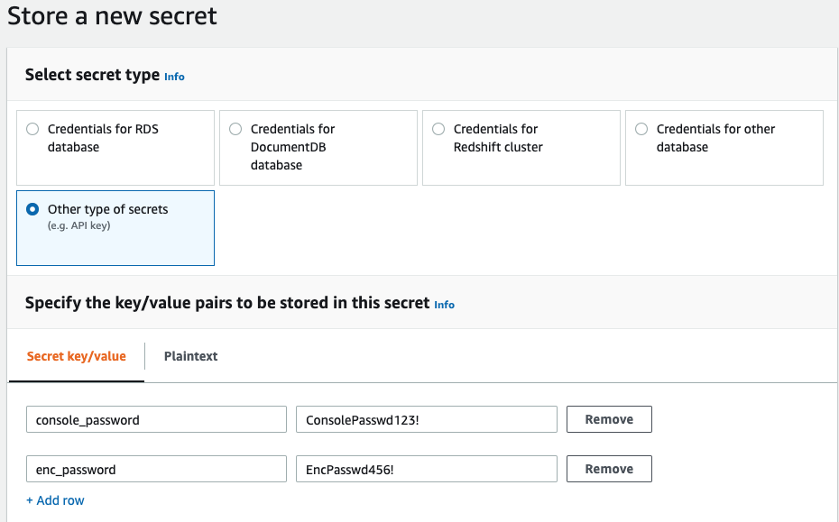

# TFE on AWS
This Terraform module deploys TFE on AWS. The code should be reviewed, potentially tweaked/customized, and **tested in the lab prior to deploying in production**. The _Operational Mode_ is **External Services**, and both  **Online** and **Airgap** _Installation Methods_ are supported. See the [Example Scenarios](#Example-Scenarios) section below for details on deployment scenarios, instructions, and examples. Test this in the lab before deploying to production.
<p>&nbsp;</p>


## Requirements
- Terraform >= 0.14
- TFE license file from Replicated (`.rli` file extension)
<p>&nbsp;</p>


## Prerequisites
- AWS account
- VPC with subnets (minimum of 2, preferably 3)
- One of the following depending on the deployment scenario:
    - **Public** Route53 Hosted Zone (Hosted Zone type must be **Public** for DNS certificate validation to be fully automated by Terraform)
    - TLS/SSL Certificate ARN (imported into either **ACM** or **IAM**) with a Common Name matching the desired TFE hostname/FQDN (`tfe_hostname` input variable)
 

_Note: a [prereqs helper](https://github.com/hashicorp/is-terraform-aws-tfe-standalone-prereqs) module is available for reference and/or use._
<p>&nbsp;</p>


## Usage
 This module supports multiple common deployment scenarios across customers' AWS cloud environments. The strategic architectural questions listed below will help derive which deployment scenario should be followed.

  1. Where is the Version Control System (VCS) and/or CI/CD system hosted?  Public Internet (SaaS)/external or private/on-prem/internal?  This will dictate the following:
      - Whether the Load Balancer subnets will need to be public or private
      - Whether the Load Balancer exposure will be external or internal
      - Whether the TFE hostname/FQDN DNS record will need to be externally/publicly resolvable or internal
      - Whether the TLS/SSL certificate will need to be signed by a publicly trusted CA or a private/custom CA
  2. Which DNS service will be used?  Route53 or internal/custom?
  3. Where will the TLS/SSL certificate be issued from?  AWS Certificate Manager (ACM), another Public CA, or private/custom CA?

### Example Scenarios
 - [Prerequisites Helper](https://github.com/hashicorp/is-terraform-aws-tfe-standalone-prereqs) 
 - Scenario 1 - [Route53 and ACM](./examples/route53-and-acm/README.md)
 - Scenario 2 - [Custom DNS and TLS/SSL](./examples/custom-dns-and-tls/README.md)
<p>&nbsp;</p>


## Inputs

| Name | Description | Type | Default | Required |
|------|-------------|------|---------|:--------:|
| airgap\_install | Boolean indicating whether TFE install is airgap (true) or online (false). | `bool` | `false` | no |
| alb\_subnet\_ids | List of subnet IDs to use for the load balancer. | `list(string)` | n/a | yes |
| ami\_id | Custom AMI ID for TFE EC2 Launch Template.  If specified, value os\_distro must coincide with this AMI OS distro. | `string` | `null` | no |
| asg\_instance\_count | Number of EC2 instances to run in Autoscaling Group. Normally the TFE Primary instance should be set to 1 and Secondary should be set to 0. | `number` | `1` | no |
| aws\_secretsmanager\_secret\_arn | ARN of secret metadata stored in AWS Secrets Manager. If specified, secret must contain key/value pairs for console\_password and enc\_password; and optionally tfe\_initial\_admin\_pw. | `string` | `""` | no |
| bucket\_replication\_configuration | Map containing S3 Cross-Region Replication configuration. | `any` | `{}` | no |
| capacity\_concurrency | Total concurrent Terraform Runs (Plans/Applies) within TFE. | `string` | `"10"` | no |
| capacity\_memory | Maxium amount of memory (MB) that a Terraform Run (Plan/Apply) can consume within TFE. | `string` | `"512"` | no |
| common\_tags | Map of common tags for taggable AWS resources. | `map(string)` | `{}` | no |
| console\_password | Password to unlock TFE Admin Console accessible via port 8800. Specify `aws_secretsmanager` to retrieve from AWS Secrets Manager via `aws_secretsmanager_secret_arn` input. | `string` | n/a | yes |
| create\_route53\_alias\_record | Boolean indicating whether to create Route53 Alias Record resolving to Load Balancer DNS name (true) or not (false) when `route53_hosted_zone_public` is also specified. This variable is only relevant when route53\_hosted\_zone\_public is also specified. | `bool` | `true` | no |
| destination\_bucket | Destination S3 Bucket for Cross-Region Replication configuration. Should exist in Secondary region. | `string` | `""` | no |
| ec2\_subnet\_ids | List of subnet IDs to use for the EC2 instance. Private subnets is the best practice. | `list(string)` | n/a | yes |
| enc\_password | Password to protect unseal key and root token of TFE embedded Vault. Specify `aws_secretsmanager` to retrieve from AWS Secrets Manager via `aws_secretsmanager_secret_arn` input. | `string` | n/a | yes |
| friendly\_name\_prefix | String value for freindly name prefix for AWS resource names. | `string` | n/a | yes |
| ingress\_cidr\_alb\_allow | List of CIDR ranges to allow web traffic ingress to TFE load balancer. | `list(string)` | <pre>[<br>  "0.0.0.0/0"<br>]</pre> | no |
| ingress\_cidr\_console\_allow | List of CIDR ranges to allow TFE Replicated admin console (port 8800) traffic ingress to TFE load balancer. | `list(string)` | `null` | no |
| ingress\_cidr\_ec2\_allow | List of CIDR ranges to allow SSH ingress to TFE EC2 instance (i.e. Bastion host IP, workstation IP, etc.). | `list(string)` | `[]` | no |
| instance\_size | EC2 instance type for TFE Launch Template. | `string` | `"m5.xlarge"` | no |
| is\_secondary | Boolean indicating whether TFE instance deployment is for Primary region or Secondary region. | `bool` | `false` | no |
| kms\_key\_arn | ARN of KMS key to encrypt TFE RDS and S3 resources. | `string` | `""` | no |
| load\_balancer\_is\_internal | Boolean indicating if Application Load Balancer exposure is internal or external. Only specify `true` for internal. | `bool` | `false` | no |
| os\_distro | Linux OS distribution for TFE EC2 instance. Choose from amzn2, ubuntu, centos, rhel. | `string` | `"amzn2"` | no |
| rds\_availability\_zones | List of Availability Zones to spread RDS Cluster across. | `list(string)` | `null` | no |
| rds\_backup\_retention\_period | Daily time range (UTC) for RDS backup to occur. Must not overlap with maintenance\_window if specified. | `string` | `7` | no |
| rds\_database\_name | Name of database. | `string` | `"tfe"` | no |
| rds\_engine | Name of database engine. | `string` | `"aurora-postgresql"` | no |
| rds\_engine\_mode | RDS engine mode. | `string` | `"provisioned"` | no |
| rds\_engine\_version | Version of Aurora PostgreSQL Global Database engine. | `number` | `11.9` | no |
| rds\_global\_cluster\_id | RDS Global Cluster identifier. Intended to be used by RDS Cluster Instance in Secondary region. | `string` | `null` | no |
| rds\_instance\_class | Instance class size for RDS Aurora. | `string` | `"db.r5.xlarge"` | no |
| rds\_master\_password | Password for RDS master DB user. | `string` | n/a | yes |
| rds\_master\_username | Username for the master DB user. | `string` | `"tfe"` | no |
| rds\_preferred\_backup\_window | Daily time range (UTC) for RDS backup to occur. Must not overlap with maintenance\_window if specified. | `string` | `"04:00-04:30"` | no |
| rds\_preferred\_maintenance\_window | Window (UTC) to perform RDS database maintenance. Must not overlap with rds\_backup\_window if specified. | `string` | `"Sun:08:00-Sun:09:00"` | no |
| rds\_replica\_count | Amount of Aurora Replica instances to deploy within the Database Cluster within the same region. | `number` | `1` | no |
| rds\_replication\_source\_identifier | ARN of a source DB cluster or DB instance if this DB cluster is to be created as a Read Replica. Intended to be used by RDS Cluster Instance in Secondary region. | `string` | `null` | no |
| rds\_skip\_final\_snapshot | Boolean indicating whether to perform an RDS final snapshot (true) or not (false). | `bool` | `false` | no |
| rds\_storage\_capacity | Size capacity (GB) of RDS PostgreSQL database. | `string` | `"50"` | no |
| rds\_subnet\_ids | List of subnet IDs to use for RDS Database Subnet Group. Private subnets is the best practice. | `list(string)` | n/a | yes |
| remove\_import\_settings\_from | Replicated setting to automatically remove the settings.json file (referred to as `ImportSettingsFrom` by Replicated) after installation. | `bool` | `false` | no |
| replicated\_bundle\_path | Full path of Replicated bundle (replicated.tar.gz) in S3 bucket. A local filepath is not supported because the Replicated bundle is too large for user\_data. Only specify if `airgap_install` is `true`. | `string` | `""` | no |
| route53\_hosted\_zone\_public | Public Route53 Hosted Zone name where `tfe_hostname` Alias record and Certificate Validation CNAME record will reside. Required if `tls_certificate_arn` is not specified. | `string` | `null` | no |
| source\_region | Source region for RDS Cross-Region Replication. Only specify for Secondary instance. | `string` | `null` | no |
| ssh\_key\_pair | Name of SSH key pair for TFE EC2 instance. | `string` | `""` | no |
| tfe\_airgap\_bundle\_path | Full path of TFE airgap bundle in S3 bucket. A local filepath is not supported because the airgap bundle is too large for user\_data. Only specify if `airgap_install` is `true`. | `string` | `""` | no |
| tfe\_bootstrap\_bucket | Name of existing S3 bucket containing prerequisite files for TFE automated install. Typically would contain TFE license file and airgap files if `airgap_install` is `true`. | `string` | `""` | no |
| tfe\_hostname | Hostname/FQDN of TFE instance. This name should resolve to the load balancer DNS name. | `string` | n/a | yes |
| tfe\_initial\_admin\_email | Email address for initial TFE local administrator account. Only specify if it is desired to have the Initial Admin User created during the automated install. | `string` | `""` | no |
| tfe\_initial\_admin\_password | Password of TFE Initial Admin User. Required only if `tfe_initial_admin_username` is also specified. Specify `aws_secretsmanager` to retrieve from AWS Secrets Manager via `aws_secretsmanager_secret_arn` input. | `string` | `""` | no |
| tfe\_initial\_admin\_username | Username for initial TFE local administrator account. Only specify if it is desired to have the Initial Admin User created during the automated install. | `string` | `""` | no |
| tfe\_initial\_org\_email | Email address of initial TFE Organization created by bootstrap (user\_data) process. | `string` | `""` | no |
| tfe\_initial\_org\_name | Name of initial TFE Organization created by the bootstrap (user\_data) process. | `string` | `""` | no |
| tfe\_license\_filepath | Full filepath of TFE license file (.rli file extension). A local filepath or S3 is supported. | `string` | n/a | yes |
| tfe\_release\_sequence | TFE application version release sequence number within Replicated. Leave default for latest version. Not needed if `airgap_install` is `true`. | `string` | `""` | no |
| tls\_bootstrap\_cert | Path to certificate file in PEM format on TFE server if TLS/SSL is terminated at the instance-level. Only specify if `tls_bootstrap_type` is `server-path`. | `string` | `""` | no |
| tls\_bootstrap\_key | Path to certificate private key in PEM format on TFE server if TLS/SSL is terminated at the instance-level. Only specify if `tls_bootstrap_type` is `server-path`. | `string` | `""` | no |
| tls\_bootstrap\_type | Type of TLS cert to use. If set to `server-path`, variables `tls_bootstrap_cert` and `tls_bootstrap_key` are also required. | `string` | `"self-signed"` | no |
| tls\_certificate\_arn | ARN of ACM or IAM certificate to be used for Application Load Balancer HTTPS listeners. Required if route53\_hosted\_zone\_public is not specified. | `string` | `null` | no |
| vpc\_id | VPC ID that TFE will be deployed into. | `string` | n/a | yes |


## Outputs

| Name | Description |
|------|-------------|
| rds\_cluster\_arn | ARN of RDS Aurora Cluster. |
| rds\_cluster\_members | List of RDS Instances that are part of this RDS Cluster. |
| rds\_global\_cluster\_id | RDS Aurora Global Cluster identifier. |
| s3\_bucket\_arn | Name of TFE S3 bucket. |
| s3\_bucket\_name | Name of TFE S3 bucket. |
| s3\_crr\_iam\_role\_arn | ARN of S3 Cross-Region Replication IAM Role. |
| tfe\_admin\_console\_url | URL of TFE (Replicated) Admin Console based on `tfe_hostname` input. |
| tfe\_alb\_dns\_name | DNS name of AWS Application Load Balancer. |
| tfe\_url | URL of TFE application based on `tfe_hostname` input. |
<p>&nbsp;</p>


## Secrets Management

There are mainly three sensitive values (and a fourth optional value) when automating a TFE on AWS deployment:

- **RDS password** (`var.rds_master_password`) - PostgreSQL RDS password. The only way to specify this value is via the Terraform input variable `var.rds_master_password` as there is no way around this argument not being present on the `aws_rds_cluster.tfe` resource when Terraform runs.

- **Admin Console password** (`var.console_password`) - password to unlock the TFE (Replicated) Admin Console on port 8800. 

- **Embedded Vault Encryption password** (`var.enc_password`) - embedded Vault container "secret zero" that protects its unseal key and root token.

- **Initial Admin User password** (`var.tfe_initial_admin_password`) - **optional** password for the TFE Initial Admin User (see Advanced Bootstrap section below). It is only required when `var.tfe_initial_admin_username` is also optionally specified.

Aside from `var.rds_master_password`, here are the two options to handle the secrets listed above:
1. Specify the desired values directly as Terraform input variables.
2. Create a secret in **AWS Secrets Manager** as a prerequisite to deploying this module (keeps secrets out of Terraform State). The `user_data` script will automatically retrieve them during the cloud-init process via `awscli`.

### AWS Secrets Manager usage
If option 2 listed above is desirable, here are the steps to follow:
1. Create a single secret in AWS Secrets Manager with key/value pairs for each value desirable to store:

2. Specify the ARN of the secret via the Terraform input variable `aws_secretsmanager_secret_arn`.
3. Specify `aws_secretsmanager` for each Terraform input variable value that is to be stored in AWS Secrets Manager. For example:

```hcl
module "tfe" {
  ...
  aws_secretsmanager_secret_arn = "arn:aws:secretsmanager:us-east-1:000000000000:secret:tfe-bootstrap-secrets-abcdef"
  console_password              = "aws_secretsmanager"
  enc_password                  = "aws_secretsmanager"
  ...
}
```

In this case, the module knows to query AWS Secrets Manager to retrieve the `console_password` and `enc_password` because they are both set to `aws_secretsmanager`.
<p>&nbsp;</p>


## Troubleshooting
To monitor the progress of the install (cloud-init process), SSH into the EC2 instance and run `journalctl -xu cloud-final -f` to tail the logs (remove the `-f` if the cloud-init process has finished).  Consider leveraging a bastion host in the VPC for SSH connectivity to the EC2 instance when it is deployed onto private subnets unless there is a Direct Connect, VPN, VPC peering, etc. already in place. Or, others may choose to disable SSH ingress and instead leverage something like [AWS SSM Agent](https://docs.aws.amazon.com/systems-manager/latest/userguide/prereqs-ssm-agent.html) for connectivity to the EC2 instance.
<p>&nbsp;</p>


## Post Deploy

### Logging In
After the Terraform run has completed successfully, give the EC2 instance around 7-12 minutes after it has finished initializing before launching a browser and attempting to login to TFE. Unless the _Advanced Bootstrap_ input variables were specified (see section below for details), first connect to the TFE Admin Console on port 8800 (`https://<tfe_hostname>:8800`) and authenticate using the value of `console_password`. From the Dashboard page, after verifying the application is started, click the **open** link underneath the **Stop Now** button to create the Initial Admin User and in turn the initial Organization.

### Advanced Bootstrap
This is an advanced usage feature that the module supports in regards to automatically creating or "bootstrapping" the Initial Admin User creation and optionally the initial Organization creation from within the `user_data` script. Here are the input variables to specify in order to leverage this functionality:

#### Initial Admin User
- `tfe_initial_admin_username`
- `tfe_initial_admin_email`
- `tfe_initial_admin_password`

#### Initial Organization
- `tfe_initial_org_name`
- `tfe_initial_org_email`

It is possible to only specify the **Initial Admin User** inputs and skip the **Initial Organization** inputs, however the initial Organization creation is dependent on the Initial Admin User existing so the **Initial Admin User** inputs are required if the **Initial Organization** inputs are specified.

Example:
```hcl
module "tfe" {
  ...
  tfe_initial_admin_username = "tfe-admin"
  tfe_initial_admin_email    = "tfe-admin@whatever.com"
  tfe_initial_admin_pw       = "aws_secretsmanager"
  tfe_initial_org_name       = "acme"
  tfe_initial_org_email      = "tfe-admin@whatever.com"
  ...
}
```

